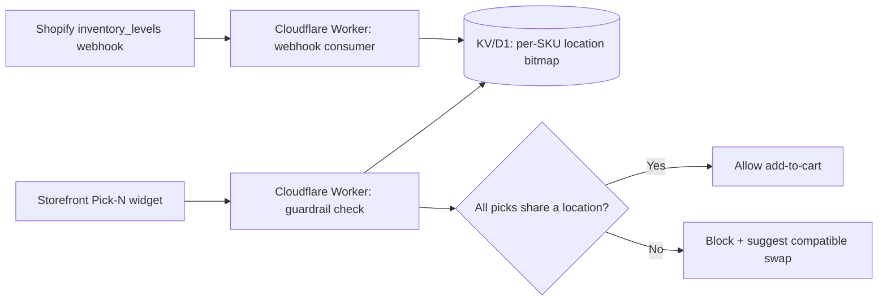

# BoxCraft — Detailed Plan

2026-09-22 · @Someone

## Overview

BoxCraft is a Shopify app that lets multi-warehouse DTC brands (consumables, beverages, coffee, customizable kits) sell "Build-a-Box" bundles without triggering unplanned split shipments or blowing past Shopify's native bundle limits.

**Problem.** Shopify's native Bundles app checks inventory as a global aggregate — it doesn't know that a customer's 4-item mix has 2 items in an East Coast 3PL and 2 in a West Coast one. That produces split shipments (double freight/packaging) or backorders. Native Bundles also caps out at 3 options and 100 variants, which blocks flexible "Pick 4 of 20" configurations. Existing third-party bundle apps solve flexibility but charge $200–500/mo plus GMV-based fees and often rely on client-side JS that slows storefronts or breaks Liquid themes.

**Solution.** A theme app extension for the Pick-N picker, a location-aware guardrail that blocks incompatible combinations before add-to-cart, and native Shopify Cart Transform bundling (`linesMerge`/`lineExpand`) for clean single-line checkout presentation — all at flat monthly pricing with no revenue tax.

**Target customer.** Growing DTC brands on Basic/Shopify/Advanced plans (not Plus-only) running 2+ fulfillment locations, selling consumable or kit-style products where AOV is driven by mix-and-match bundling.

**Positioning.** The lean, flat-rate alternative to enterprise bundle apps (Bold, Rebuild) — the only player doing location-aware split-shipment prevention at any price point, let alone at $19–49/mo.

## Technical Architecture

**Cart Transform operations, verified against Shopify's current docs (shopify.dev/docs/api/functions/latest/cart-transform):**

| Operation | Purpose | Plan requirement |
| --- | --- | --- |
| `lineExpand` | Unpack a bundle line to show its components | All plans |
| `linesMerge` | Collapse multiple lines into one bundle line, with its own price adjustment (`percentageDecrease` only) | All plans |
| `lineUpdate` | Override price/title/image on an existing line without changing structure | Shopify Plus and dev stores only |

BoxCraft only needs `linesMerge` and `lineExpand` for one-time-purchase bundling — real single-line checkout presentation works on every plan, not just Plus.

**Hard constraint: subscriptions.** Shopify rejects `lineExpand`, `linesMerge`, and `lineUpdate` outright if a selling plan is present on the cart line. Cart Transform cannot touch a recurring "box of the month" line at all, on any plan. Recurring bundle support (Recharge/Skio-style) requires a different mechanism — component-level selling plans or a metafield-driven kit structure managed outside Cart Transform — and is out of scope for v1.

**Location-aware guardrail.** Per-location inventory is only exposed via the Admin API, not the Storefront API, so the check can't run purely client-side.

The webhook consumer keeps a precomputed compatibility bitmap current; the guardrail check reads that cache instead of hitting the Admin API live, keeping response times low even during traffic spikes and avoiding GraphQL cost-based throttling.

**Open item:** `inventory_levels/update` fires per location per SKU change — a large catalog across multiple 3PLs will generate meaningful webhook volume. Needs a debounce/batch decision before this is a production concern.

## Phased Build Plan

| Phase | Scope | Key deliverables |
| --- | --- | --- |
| v1 — One-time bundles | Core Pick-N + native checkout merge | Theme app extension picker, `linesMerge`/`lineExpand` Cart Transform function, single bundle line at checkout on all plans |
| v2 — Location guardrails | Split-shipment prevention | Cloudflare Worker guardrail service, webhook consumer + KV/D1 bitmap cache, pre-add-to-cart blocking UI |
| v3 — Subscription support | Recurring Build-a-Box | Recharge/Skio component-level selling plan integration (or metafield-driven kit structure) — separate track from Cart Transform |

v1 and v2 ship the core value proposition (flexible bundling + split-shipment prevention) without touching the subscription problem. v3 is scoped separately because it's a different integration surface entirely (a subscription app's own APIs, not Shopify's cart), not a simple extension of v1/v2.

## Pricing and Billing

**Tiers (feature-gated, not usage-gated, for v1):**

| Tier | Price | Scope |
| --- | --- | --- |
| Starter | $19/mo | Single guardrail rule, basic Pick-N |
| Pro | $49/mo | Unlimited Pick-N configs;subscription support once v3 ships |

Feature-gating avoids building metering infrastructure before it's needed; usage-gating (SKU count, order volume) is a later option once real usage data exists.

**Billing mechanism.** Shopify's `AppSubscription` API (Admin GraphQL): `appSubscriptionCreate` returns a confirmation URL hosted natively inside Shopify admin. Merchant approves in-platform — no separate card entry, charges land on their existing Shopify invoice. `trialDays` is a native field, no custom trial logic needed. Managed Pricing (Partner Dashboard-hosted plans) is the lower-effort path for flat tiers like these and is the recommended v1 approach over hand-rolled GraphQL billing calls.

**Known friction point:** switching a merchant between tiers by default cancels the old subscription and re-prompts approval (`replacementBehavior`) — a second click on upgrade/downgrade, not seamless. Don't promise frictionless plan switching in marketing copy.

**Shopify's revenue share** (confirmed via shopify.dev/docs/apps/launch/distribution/revenue-share): 0% on the first $1,000,000 USD in lifetime gross app revenue, 15% above that, plus a flat 2.9% payment processing fee on all billing. The $1M threshold is lifetime (not annual, as of a 2025 policy change) and resets only if the developer crosses $20M/year in App Store earnings or $100M+ in company revenue, at which point the 0% tier disappears entirely.

At $19–49/mo, roughly 1,700–4,400 paying merchants are needed before Shopify's 15% cut applies to anything — effectively full margin retention (net of the 2.9% processing fee) through early growth.

## Go-to-Market

**Segment.** DTC consumables/beverage/coffee/kit brands on Basic/Shopify/Advanced plans running 2+ fulfillment locations (own warehouse + 3PL, or multiple 3PLs). Excludes Plus merchants — that segment is already served by Bold/Rebuild at their price point.

**Positioning statement.** "BoxCraft gives growing merchants enterprise-grade, multi-warehouse Build-a-Box capabilities at flat-rate pricing — protecting order margins from split shipments without slowing down checkout."

**Channels:**

- Shopify App Store listing, SEO-targeted on "Shopify multi-location bundle," "split shipment prevention"
- Direct outreach to 3PL-using consumable brands (identifiable via app-install signals like ShipBob/Deliverr integrations)
- Shopify Partner/agency referral relationships (agencies doing multi-warehouse migrations are a natural referral source)

**Launch sequence:**

1. Ship v1 (one-time bundles) + v2 (guardrails) together — the guardrail is the actual differentiator, shipping bundling alone doesn't distinguish from incumbents
2. Beta with 5-10 design partners from the target segment before public App Store listing, to validate the split-shipment claim against real fulfillment data
3. Public launch with case study/data from beta ("prevented N split shipments, saved $X in freight") as the core proof point
4. v3 (subscription support) as a follow-on release once demand is validated, not a v1 requirement

## Risks and Open Items

| Risk | Detail | Mitigation |
| --- | --- | --- |
| Webhook volume | `inventory_levels/update` fires per location per SKU — large catalogs across multiple 3PLs generate significant event volume | Decide debounce/batch strategy before production, not after it's a problem |
| Subscription gap | Cart Transform can't touch selling-plan lines at all; a meaningful share of target-vertical AOV (coffee/consumables) likely comes from recurring boxes | Scope v3 as a separate integration track; don't promise subscription support in v1 marketing |
| Competitive response | Incumbents (Bold, Rebuild) could add location-awareness once the wedge is proven | Guardrail + flat pricing combination is the defensible position; speed to market on the guardrail feature matters |
| Plan-switch friction | Upgrade/downgrade requires re-approval, not seamless | Don't overpromise "seamless" plan changes in copy |

**Open decisions still needed:**

- Confirm Shopify Functions Discount API plan-gating (separate from Cart Transform) before relying on it for bundle-level pricing in marketing claims
- Validate the split-shipment cost savings claim with real merchant data before using specific numbers in positioning
- Decide v1 launch scope: ship v1+v2 together (recommended) vs. v1 alone first

## Timeline and Milestones

| Milestone | Target | Scope |
| --- | --- | --- |
| v1 build complete | Week 6 | Theme app extension picker + Cart Transform `linesMerge`/`lineExpand` function |
| v2 build complete | Week 10 | Guardrail Worker, webhook consumer, KV/D1 bitmap cache |
| Design partner beta start | Week 11 | 5-10 merchants, v1+v2 combined |
| Beta feedback + fixes | Weeks 12-14 | Validate split-shipment prevention claim against real data |
| Public App Store launch | Week 15-16 | v1+v2, case study from beta |
| v3 scoping starts | Post-launch, demand-dependent | Subscription support — separate integration track, not committed to a date until v1/v2 traction is confirmed |

Dates are estimates from today (2026-09-22) assuming a single senior engineer working part-time alongside existing client commitments — compress if dedicated full-time, extend if split further across other active projects.
