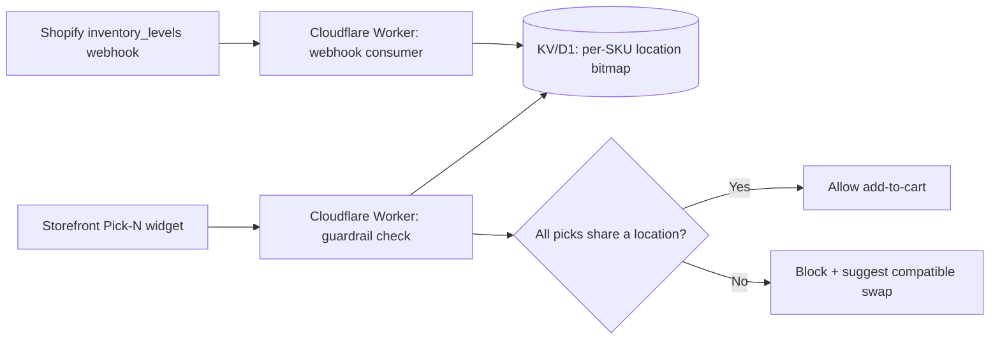

# BoxCraft — Detailed Plan

2026-09-22 · @Someone

## Overview

BoxCraft is a Shopify app that lets multi-warehouse DTC brands (consumables, beverages, coffee, customizable kits) sell "Build-a-Box" bundles without triggering unplanned split shipments or blowing past Shopify's native bundle limits.

**Problem.** Shopify's native Bundles app checks inventory as a global aggregate — it doesn't know that a customer's 4-item mix has 2 items in an East Coast 3PL and 2 in a West Coast one. That produces split shipments (double freight/packaging) or backorders. Native Bundles also caps out at 3 options and 100 variants, which blocks flexible "Pick 4 of 20" configurations. Existing third-party bundle apps solve flexibility but charge $200–500/mo plus GMV-based fees and often rely on client-side JS that slows storefronts or breaks Liquid themes.

**Solution.** A theme app extension for the Pick-N picker, a location-aware guardrail that blocks incompatible combinations before add-to-cart, and native Shopify Cart Transform bundling (`linesMerge`/`lineExpand`) for clean single-line checkout presentation — all at flat monthly pricing with no revenue tax.

**Target customer.** Growing DTC brands on Basic/Shopify/Advanced plans (not Plus-only) running 2+ fulfillment locations, selling consumable or kit-style products where AOV is driven by mix-and-match bundling.

**Positioning.** The lean, flat-rate alternative to enterprise bundle apps (Bold, Rebuild) — the only player doing location-aware split-shipment prevention at any price point, let alone at $19–49/mo.

## Technical Architecture

**Cart Transform operations, verified against Shopify's current docs (shopify.dev/docs/api/functions/latest/cart-transform):**

| Operation | Purpose | Plan requirement |
| --- | --- | --- |
| `lineExpand` | Unpack a bundle line to show its components | All plans |
| `linesMerge` | Collapse multiple lines into one bundle line, with its own price adjustment (`percentageDecrease` only) | All plans |
| `lineUpdate` | Override price/title/image on an existing line without changing structure | Shopify Plus and dev stores only |

BoxCraft only needs `linesMerge` and `lineExpand` for one-time-purchase bundling — real single-line checkout presentation works on every plan, not just Plus.

**Hard constraint: subscriptions.** Shopify rejects `lineExpand`, `linesMerge`, and `lineUpdate` outright if a selling plan is present on the cart line. Cart Transform cannot touch a recurring "box of the month" line at all, on any plan. Recurring bundle support (Recharge/Skio-style) requires a different mechanism — component-level selling plans or a metafield-driven kit structure managed outside Cart Transform — and is out of scope for v1.

**Location-aware guardrail.** Per-location inventory is only exposed via the Admin API, not the Storefront API, so the check can't run purely client-side.

The webhook consumer keeps a precomputed compatibility bitmap current; the guardrail check reads that cache instead of hitting the Admin API live, keeping response times low even during traffic spikes and avoiding GraphQL cost-based throttling.

**Open item:** `inventory_levels/update` fires per location per SKU change — a large catalog across multiple 3PLs will generate meaningful webhook volume. Needs a debounce/batch decision before this is a production concern.

## Phased Build Plan

| Phase | Scope | Key deliverables |
| --- | --- | --- |
| v1 — One-time bundles | Core Pick-N + native checkout merge | Theme app extension picker, `linesMerge`/`lineExpand` Cart Transform function, single bundle line at checkout on all plans |
| v2 — Location guardrails | Split-shipment prevention | Cloudflare Worker guardrail service, webhook consumer + KV/D1 bitmap cache, pre-add-to-cart blocking UI |
| v3 — Subscription support | Recurring Build-a-Box | Recharge/Skio component-level selling plan integration (or metafield-driven kit structure) — separate track from Cart Transform |

v1 and v2 ship the core value proposition (flexible bundling + split-shipment prevention) without touching the subscription problem. v3 is scoped separately because it's a different integration surface entirely (a subscription app's own APIs, not Shopify's cart), not a simple extension of v1/v2.

## Pricing and Billing

**One flat price, full feature set, no revenue-based gating.** Decided 2026-09-25,
after a competitive review (see "Competitive landscape" below): every
competitor found — Fast Bundle ($19–139/mo), Easy Bundles ($0–99/mo), BYOB
($25–199/mo), Appstle, Simple Bundles, Moon Bundles, Supr Bundle — prices
by the merchant's *monthly bundle sales revenue*, gating either features or
raw price to a tier that scales with the merchant's success. That's a tax
on growth. BoxCraft's pricing is the opposite, deliberately: one price,
every feature, no cap tied to how well it works for you.

**Launch price: $9.99/mo.** Below every competitor's entry tier, unrestricted.
**Target price once value is proven: $19/mo flat**, still unrestricted, still
below most competitors' *second* tier. This is a deliberate two-phase
pricing move, not an accident — the Netflix playbook (mass-adoption entry
price for years, raised only once the value was proven, still ended up one
of the most valuable media companies) is the explicit model. Market the
launch price as a launch price from day one — early merchants should know
$9.99 is an early-adopter price, not a permanent floor, so the later raise
isn't a surprise or a bait-and-switch.

**No tiers to build.** A single Managed Pricing plan is simpler to ship
than the two-tier structure this section previously specified, and removes
the upgrade/downgrade friction (`replacementBehavior` re-prompting
approval) that a multi-tier structure would otherwise hit.

**Billing mechanism.** Shopify's `AppSubscription` API (Admin GraphQL):
`appSubscriptionCreate` returns a confirmation URL hosted natively inside
Shopify admin. Merchant approves in-platform — no separate card entry,
charges land on their existing Shopify invoice. `trialDays` is a native
field, no custom trial logic needed. Managed Pricing (Partner
Dashboard-hosted plans) is the lower-effort path for a single flat plan
and is the recommended approach over hand-rolled GraphQL billing calls.

**Shopify's revenue share** (confirmed via shopify.dev/docs/apps/launch/distribution/revenue-share):
0% on the first $1,000,000 USD in lifetime gross app revenue, 15% above
that, plus a flat **2.9% payment processing fee on all billing regardless
of the threshold**. The $1M threshold is lifetime (not annual, as of a
2025 policy change) and resets only if the developer crosses $20M/year in
App Store earnings or $100M+ in company revenue.

**Margin reality check, done honestly rather than rounded up.** At $19/mo:
2.9% processing fee ($0.55) always applies, leaving ~$18.45 before infra —
Cloudflare Workers/D1/KV costs at this app's usage shape are low and scale
sub-linearly with merchant count (not literally zero, but a small
per-merchant marginal cost, not a meaningful drag on the math below). With
no dedicated engineering team — this app is built and operated by one
person working with Claude Code sessions rather than a salaried team —
there's no traditional SaaS payroll/opex line eating the rest. Net: gross
margin in the high 80s–90%+ is realistic, not literally "100% pure
profit" (support time, ongoing development, and the operator's own time
are real costs, just not ones that show up as a line item the way a
team's payroll would). At $19/mo × 1,000 paying merchants, that's roughly
$18,000–18,400/mo (~$220K/year) before tax and before valuing the
operator's own time — a genuinely meaningful outcome for a single-operator
product, not a rounding error. 1,000 active merchants at a low,
unrestricted, competitor-undercutting price is a more realistic path
there than a handful of large accounts on a $49–199 tier waiting on a
sales motion this project doesn't have.

## Go-to-Market

**Segment.** DTC consumables/beverage/coffee/kit brands on Basic/Shopify/Advanced plans running 2+ fulfillment locations (own warehouse + 3PL, or multiple 3PLs) remain the sharpest wedge (the guardrail is a real, verified-unaddressed gap there — see "Competitive landscape" below). But the pricing/positioning model below is deliberately broader than that one segment: any merchant who wants their customers building their own bundles, unrestricted, at one honest price. Plus merchants aren't excluded on principle the way they were in the original plan — $9.99–19/mo flat is trivial spend at that scale too, and "unrestricted" reads as credible at any store size.

**Positioning statement (updated 2026-09-25).** "The most comprehensive, affordable build-a-box tool on Shopify — one price, every feature, whether you're a startup or a Fortune 500 brand. Let your customers build the bundle, set your own rules for what can (and can't) go together, and stop paying more as you grow." The multi-location guardrail is a feature inside this story, not the whole story — it's the thing competitors verifiably don't have (see below), but "unrestricted flat pricing, customer-built bundles" is the primary pitch, since the guardrail alone isn't a defensible platform (see `assumptions.md`'s "Positioning" note, 2026-09-25).

**Channels:**

- Shopify App Store listing, SEO-targeted on "Shopify multi-location bundle," "split shipment prevention"
- Direct outreach to 3PL-using consumable brands (identifiable via app-install signals like ShipBob/Deliverr integrations)
- Shopify Partner/agency referral relationships (agencies doing multi-warehouse migrations are a natural referral source)

**Launch sequence:**

1. Ship v1 (one-time bundles) + v2 (guardrails) together — the guardrail is the actual differentiator, shipping bundling alone doesn't distinguish from incumbents
2. Beta with 5-10 design partners from the target segment before public App Store listing, to validate the split-shipment claim against real fulfillment data
3. Public launch with case study/data from beta ("prevented N split shipments, saved $X in freight") as the core proof point
4. Subscription support (v3) as a follow-on release, via the integration path below — not a from-scratch build, and not a v1 requirement

## Competitive landscape (researched 2026-09-25)

The Shopify App Store returns **3,811 results** for "bundles" — this category
is fully commoditized on the generic feature (mix & match / BOGO / volume
discount / cross-sell). Reviewed in depth: Fast Bundle (5.0★, 3,461
reviews), Easy Bundles (4.9★, 1,332), Appstle Bundles (5.0★, 1,129), Simple
Bundles & Kits (4.9★, 798), Moon Bundles (5.0★, 653), BYOB (4.7★, 71),
Bundlex (5.0★, 172), Supr Bundle (5.0★, 273), Easify Box BYOB (5.0★, 294).
All converge on the same feature checklist and the same revenue-scaled
pricing model (see "Pricing and Billing" above).

**The location guardrail holds up as a real, verified gap.** Two apps use
language that sounds adjacent ("3PL sync," "WMS/ERP fulfillment" — Easy
Bundles, Simple Bundles) but on direct investigation both mean
inventory-*count* accuracy across systems, not shipment-location routing
or pre-cart blocking. Shopify's own native Fulfillment Constraints
Function API can enforce same-location fulfillment, but only generically
(any order) and at checkout, not inside a bundle picker in real time; one
App Store app wraps it, free, zero reviews. Nobody combines "build-a-box
picker" with "reject an incompatible pick before it hits the cart." That
said, it's not a defensible platform on its own — no technical moat (Cart
Transform is the same public primitive several competitors already build
on) — which is why it's positioned as a feature inside the pricing/breadth
story above, not the whole pitch.

**Subscription build-a-box is a dead end to build from scratch, but a live
integration opportunity.** Recharge and Loop Subscriptions both already
ship "build a box, recurring, with tiered discounts" as a mature, working
feature — this specific idea is not an underserved gap, it's owned by the
subscription-platform incumbents. Confirmed live (2026): Shopify's Cart
Transform still cannot touch selling-plan lines at all, and Shopify's own
Selling Plans API does **not** auto-bill — an app must run its own
scheduler and explicitly call `subscriptionBillingAttemptCreate` on every
cycle, with zero platform help on failed-payment retry/dunning. Building
that natively from scratch is a genuine subscription-platform project, on
the order of what Recharge/Loop/Seal themselves had to build — not a
cheap fallback. The realistic path is integration, not reinvention: **Seal
Subscriptions has an open API** (per-merchant token, no partner-approval
gate, official client on GitHub) and is the fastest real path to shipping
"customer builds the box → it subscribes." **Recharge requires approval
into their Technology Partner Program** for a real multi-merchant
integration (a single-store token works for prototyping only) — worth
pursuing given Recharge's dominance in the DTC/consumables segment, but
not a v1-blocking dependency. A from-scratch native billing engine ("no
subscription app? we have one") is explicitly deferred — treat it as a
possible future decision once real merchant demand is confirmed, not a
default to build now.

## Risks and Open Items

| Risk | Detail | Mitigation |
| --- | --- | --- |
| Webhook volume | `inventory_levels/update` fires per location per SKU — large catalogs across multiple 3PLs generate significant event volume | Decide debounce/batch strategy before production, not after it's a problem |
| Subscription gap | Cart Transform can't touch selling-plan lines at all; a meaningful share of target-vertical AOV (coffee/consumables) likely comes from recurring boxes | Scope v3 as a separate integration track; don't promise subscription support in v1 marketing |
| Competitive response | Incumbents (Bold, Rebuild) could add location-awareness once the wedge is proven | Guardrail + flat pricing combination is the defensible position; speed to market on the guardrail feature matters |
| Plan-switch friction | Upgrade/downgrade requires re-approval, not seamless | Don't overpromise "seamless" plan changes in copy |

**Open decisions still needed:**

- Confirm Shopify Functions Discount API plan-gating (separate from Cart Transform) before relying on it for bundle-level pricing in marketing claims
- Validate the split-shipment cost savings claim with real merchant data before using specific numbers in positioning
- Decide v1 launch scope: ship v1+v2 together (recommended) vs. v1 alone first

## Timeline and Milestones

| Milestone | Target | Scope |
| --- | --- | --- |
| v1 build complete | Week 6 | Theme app extension picker + Cart Transform `linesMerge`/`lineExpand` function |
| v2 build complete | Week 10 | Guardrail Worker, webhook consumer, KV/D1 bitmap cache |
| Design partner beta start | Week 11 | 5-10 merchants, v1+v2 combined |
| Beta feedback + fixes | Weeks 12-14 | Validate split-shipment prevention claim against real data |
| Public App Store launch | Week 15-16 | v1+v2, case study from beta |
| v3 scoping starts | Post-launch, demand-dependent | Subscription support — separate integration track, not committed to a date until v1/v2 traction is confirmed |

Dates are estimates from today (2026-09-22) assuming a single senior engineer working part-time alongside existing client commitments — compress if dedicated full-time, extend if split further across other active projects.
