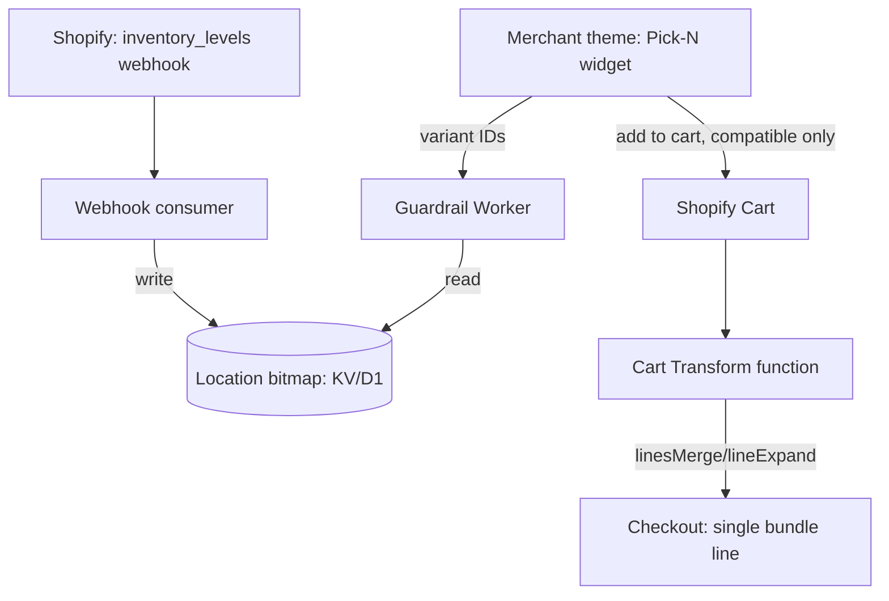
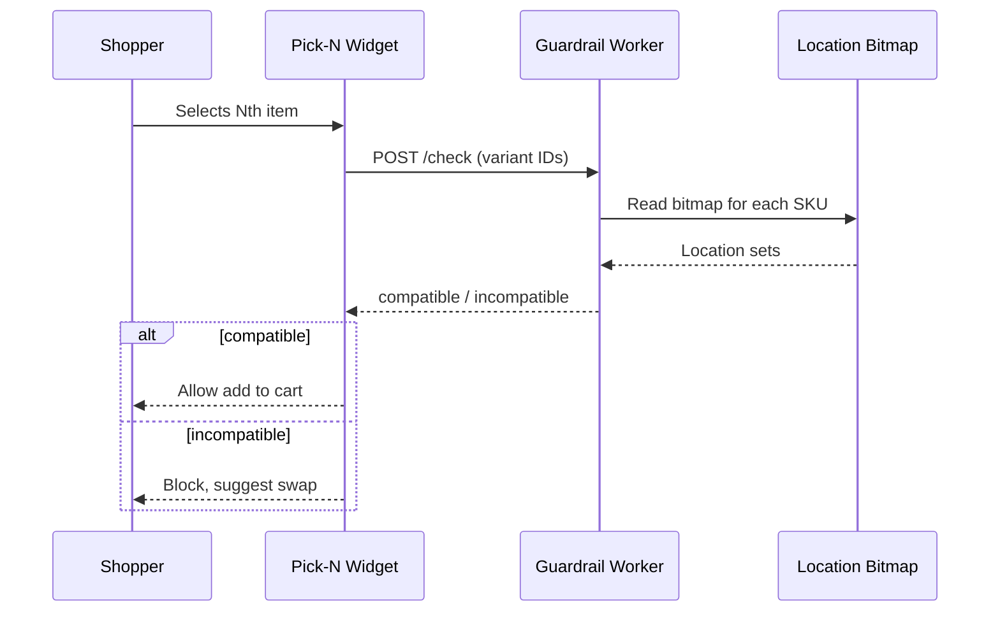
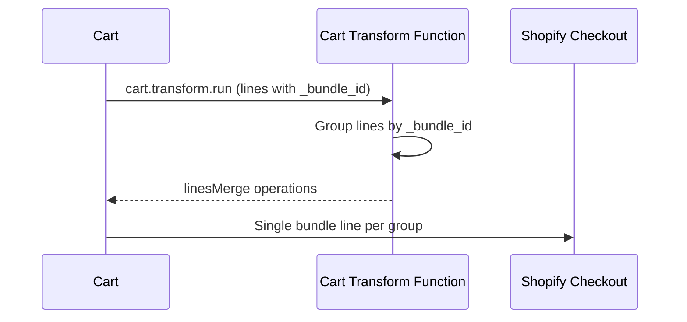

# BoxCraft — Technical Spec

2026-09-22 · @Someone

## System Overview

Five components, v1+v2 scope only (subscriptions out of scope, see Plan):

1. **Theme app extension (storefront)** — Pick-N picker UI, rendered in the merchant's theme without Liquid injection. Calls the Guardrail Worker on each selection change.
2. **Guardrail Worker (Cloudflare Worker)** — stateless HTTP service. Given a set of variant IDs, checks the location-compatibility bitmap and returns which fulfillment locations (if any) can fulfill the full set.
3. **Webhook consumer (Cloudflare Worker)** — subscribes to Shopify's `inventory_levels/update` webhook, keeps the bitmap current.
4. **Location bitmap (Cloudflare KV or D1)** — per-SKU, per-location boolean availability, read by the Guardrail Worker, written by the webhook consumer.
5. **Cart Transform function (Shopify Function, Rust/AssemblyScript/JS)** — runs at cart/checkout time, executes `linesMerge`/`lineExpand` to present the bundle as one line.



The Guardrail Worker and webhook consumer are independent of the Cart Transform function — the guardrail prevents an incompatible combination from ever reaching the cart; the Cart Transform function only handles presentation of combinations that already passed the guardrail.

## Data Models

**Location-compatibility bitmap (KV or D1).** Key per SKU, value = array of location IDs currently holding stock > 0:

```json
{
  "key": "sku:VARIANT_GID",
  "value": {
    "locations": ["gid://shopify/Location/1", "gid://shopify/Location/2"],
    "updatedAt": "2026-09-22T14:00:00Z"
  }
}
```

Guardrail check = set intersection across the `locations` arrays of every variant in the customer's current selection. Non-empty intersection = compatible; empty = incompatible, block add-to-cart.

**Cart Transform function config (`shopify.extension.toml`).** Single `cart.transform.run` target, no merchant-facing config UI needed for v1 — bundle detection driven by a cart line attribute (`_bundle_id`) set by the storefront widget, not by product/variant metafields, to avoid a metafield-per-product setup burden on merchants.

**Cart line properties (set by storefront widget on add-to-cart):**

| Property | Purpose |
| --- | --- |
| `_bundle_id` | Groups N cart lines into one bundle for the Cart Transform function to merge |
| `_bundle_price` | Computed bundle price, total bundle price, converted by the function to a `percentageDecrease` off the merged lines' list total |

No merchant-facing metafields required for v1 — keeps setup to "install app, add theme block" with no product data migration.

## API Contracts

**Guardrail Worker — `POST /check`**

Request:

```json
{ "variantIds": ["gid://shopify/ProductVariant/1", "gid://shopify/ProductVariant/2"] }
```

Response (compatible):

```json
{ "compatible": true, "locations": ["gid://shopify/Location/1"] }
```

Response (incompatible):

```json
{ "compatible": false, "conflictingVariants": ["gid://shopify/ProductVariant/2"] }
```

Target p95 latency under 100ms — this runs on every selection change in the picker, so it has to feel instant, not just correct.

**Webhook consumer — `POST /webhooks/inventory-levels-update`**

Receives Shopify's standard `inventory_levels/update` payload (`inventory_item_id`, `location_id`, `available`). Writes/removes the location from that SKU's bitmap entry. HMAC-verified per Shopify's webhook signing requirement.

**Cart Transform function — `cart.transform.run` target**

Input query requests only `cart.lines` (id, quantity, attribute `_bundle_id`, cost) — per Shopify's own guidance, request only the fields the function needs to keep function execution fast. Output: one `linesMerge` operation per distinct `_bundle_id` group found in the cart, with `parentVariantId` set to a placeholder "bundle" product/variant the merchant configures once at install, and `price.percentageDecrease` computed from the `_bundle_price` line attribute against the merged lines' summed cost (`linesMerge` doesn't accept a fixed price).

## Sequence Flows

**Add-to-cart guardrail check:**



**Checkout-time bundle merge:**



**Inventory webhook update:** Shopify fires `inventory_levels/update` on every stock change at every location → webhook consumer verifies HMAC, updates that SKU's location entry in the bitmap → next guardrail check reflects current stock, no polling required.

## Non-Functional Requirements

| Area | Requirement |
| --- | --- |
| Guardrail Worker latency | p95 < 100ms — runs on every picker interaction, must feel instant |
| Cart Transform function | Request only needed input fields (`cart.lines`, `_bundle_id`, cost) — Shopify explicitly recommends this to keep function execution within its runtime budget |
| GraphQL rate limits | Guardrail check never calls Shopify's Admin API directly at request time — reads only the precomputed bitmap, avoiding cost-based throttling entirely |
| Webhook volume | `inventory_levels/update` fires per location per SKU change — needs a debounce/batch window (target: batch writes every 1-5 seconds per SKU rather than one KV write per event) to avoid write amplification on high-SKU-count catalogs |
| Error handling — guardrail unavailable | Fail open (allow add-to-cart) rather than fail closed, with a background reconciliation job — blocking checkout entirely on a Worker outage is worse than an occasional missed split-shipment catch |
| Error handling — Cart Transform failure | Shopify's own fallback: an erroring function simply doesn't apply its operations, cart displays unmerged lines rather than breaking checkout |
| Selling plan lines | Function must detect and skip any cart line carrying a selling plan (Shopify rejects the operation anyway, but explicit skip logic avoids relying on silent rejection) |

## Testing and Rollout

**Test scope:**

- Unit: bitmap intersection logic, Cart Transform grouping/merge logic, webhook HMAC verification
- Integration: Guardrail Worker against a seeded KV/D1 fixture across multi-location scenarios (full overlap, partial overlap, zero overlap)
- Shopify test subscriptions (native billing test mode) to verify `AppSubscription` flow before real charges
- Dev store end-to-end: full picker → guardrail → cart → Cart Transform → checkout path

**Staged rollout:**

1. Internal dev store validation (v1+v2 full flow)
2. Design partner beta (5-10 merchants, per go-to-market plan) — real inventory data, real webhook volume
3. Monitor webhook consumer write volume and Guardrail Worker latency under real traffic before public App Store listing
4. Public launch

**Monitoring:** Guardrail Worker p95/p99 latency, webhook consumer lag (time between Shopify event and bitmap update), Cart Transform function error rate (Shopify surfaces this in the Partner Dashboard).
